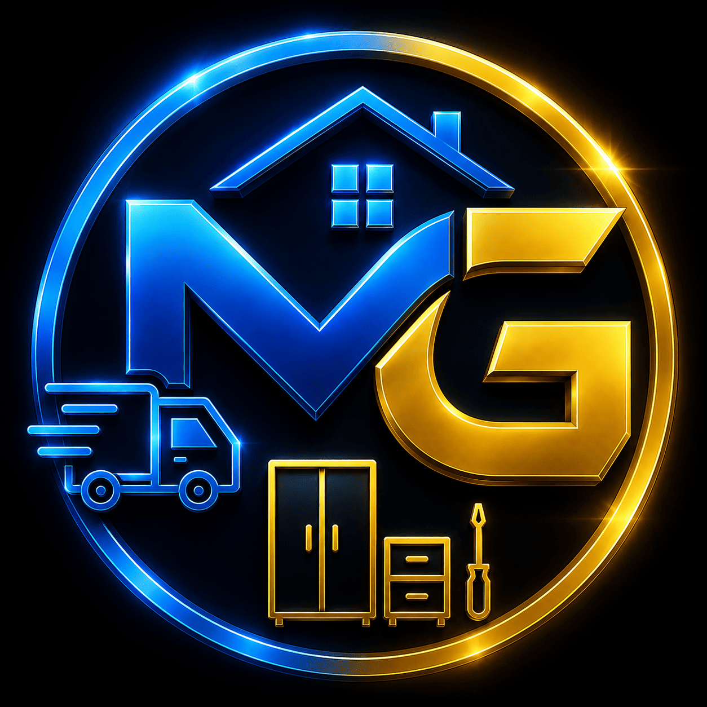

# 🌌 README-holograms.md
## MONTAFÁCIL GLOBAL • HOLOGRAMS MASTER SYSTEM

<div align="center">

# 🚀 MONTAFÁCIL GLOBAL
### THE FUTURE IS OPERATING



✨ Cinematic Holographic Experience  
✨ Cognitive Visual Ecosystem  
✨ Premium Operational Intelligence  

</div>

---

# 🌌 HOLOGRAMS MASTER SYSTEM

O sistema holográfico oficial da **MONTAFÁCIL GLOBAL** representa:

- inteligência operacional;
- integração cognitiva;
- logística premium;
- marketplace inteligente;
- expansão escalável;
- IA aplicada;
- percepção cinematográfica AAA.

A biblioteca holográfica foi criada para:

✅ Landing Pages  
✅ Pitch Decks  
✅ MVP Experience  
✅ Motion Graphics  
✅ Investor Experience  
✅ Branding Premium  
✅ Social Sharing  
✅ Cinematic Storytelling  

---

# 🚀 OBJETIVO ESTRATÉGICO

Transformar a percepção visual da plataforma em:

🌌 EXPERIÊNCIA CINEMATOGRÁFICA IMERSIVA

Transmitindo:
- inovação;
- escala;
- tecnologia;
- inteligência;
- expansão global;
- Ecossistema vivo.

---

# 📁 ESTRUTURA OFICIAL

```bash
assets/holograms/
├── holo-cover-master.png
├── holo-solucao-master.png
├── holo-problema-master.png
├── holo-diferenciais-master.png
├── holo-mercado-master.png
├── holo-start-master.png
├── holo-compartilhamento-master.png
├── holo-ecossistema-master.png
├── holo-fechamento-master.png
└── README-holograms.md


🌌 SEQUÊNCIA HOLOGRÁFICA OFICIAL


1️⃣ HOLO-COVER MASTER


holo-cover-master.png


🎯 Função


Primeira impressão global do Ecossistema.


Representa:


assinatura tecnológica;


impacto emocional;


identidade cinematográfica;


percepção premium.


✨ Sensação visual


“o futuro operacional começou.”


2️⃣ HOLO-SOLUÇÃO MASTER


holo-solucao-master.png


🎯 Função


Mostrar o Ecossistema funcionando.


Fluxo operacional:


📦 → 🔧 → 🚛 → 🛠️ → ⭐


✨ Sensação visual


“a operação é viva.”


3️⃣ HOLO-PROBLEMA MASTER


holo-problema-master.png


🎯 Função


Representar:


caos operacional;


fragmentação;


falta de integração;


dificuldade logística.


✨ Sensação visual


“o mercado atual está quebrado.”


4️⃣ HOLO-DIFERENCIAIS MASTER


holo-diferenciais-master.png


🎯 Função


Destacar:


IA integrada;


logística inteligente;


automação;


marketplace vivo;


escalabilidade.


✨ Sensação visual


“a plataforma pensa.”


5️⃣ HOLO-MERCADO MASTER


holo-mercado-master.png


🎯 Função


Mostrar:


tamanho do mercado;


expansão global;


crescimento exponencial;


potencial escalável.


✨ Sensação visual


“o mercado é gigantesco.”


6️⃣ HOLO-START MASTER


holo-start-master.png


🎯 Função


Representar:


início da operação;


ativação do Ecossistema;


aceleração da plataforma.


✨ Sensação visual


“o sistema iniciou.”


7️⃣ HOLO-COMPARTILHAMENTO MASTER


holo-compartilhamento-master.png


🎯 Função


Mostrar:


viralização;


integração social;


crescimento em rede;


compartilhamento inteligente.


✨ Sensação visual


“a rede começou a crescer.”


8️⃣ HOLO-ECOSSISTEMA MASTER


holo-ecossistema-master.png


🎯 Função


Representar:


integração total;


marketplace vivo;


IA operacional;


rede inteligente.


✨ Sensação visual


“tudo está conectado.”


9️⃣ HOLO-FECHAMENTO MASTER


holo-fechamento-master.png


🎯 Função


Encerrar:


narrativa cinematográfica;


experiência premium;


percepção de startup global.


✨ Sensação visual


“o futuro já está operando.”


🌌 IDENTIDADE VISUAL


🎨 PALETA OFICIAL


Cor
HEX


Azul Neon Principal
#00AEEF


Azul Tech Escuro
#005B96


Preto Premium
#05070D


Branco Tecnológico
#F5F7FA


Dourado Premium
#F5B700


Cinza Tecnológico
#A0A7B3


🚀 DIRETRIZES VISUAIS


✅ RECOMENDADO


fundos dark premium;


glow holográfico;


profundidade cinematográfica;


contraste elevado;


motion suave;


iluminação futurista.


❌ EVITAR


compressão excessiva;


distorções;


alteração da paleta oficial;


fundos claros sem contraste;


excesso de texto.


🌌 PADRÃO VISUAL


Referência estética:


sci-fi premium;


cinematic AAA;


holographic UI;


neural interfaces;


futurismo operacional.


🚀 APLICAÇÕES


Os holográficos foram desenvolvidos para:


✅ Landing Page Cinematic

✅ README Premium

✅ GitHub Presentation

✅ Investor Deck

✅ Splash Screens

✅ Motion Graphics

✅ Dashboard Experience

✅ MVP Visual

✅ Marketing Social

✅ App Experience


🌌 ESTRUTURA FUTURA


Integrações previstas:


Firebase
Firestore
Authentication
Marketplace
Dashboard
Analytics
AI Integration
PWA
Motion UI


🚀 STATUS OFICIAL


HOLOGRAMS MASTER SYSTEM:
██████████████████████████ 100%


🌌 ASSINATURA OFICIAL


🚀 MONTAFÁCIL GLOBAL


TECH • LOGÍSTICA • MARKETPLACE • IA


✨ The Future Is Operating


🌌 Powered by:
Curadoria Viracopos Global

Núcleo de Inovação & IA Generativa

OpenAI • ChatGPT


```
